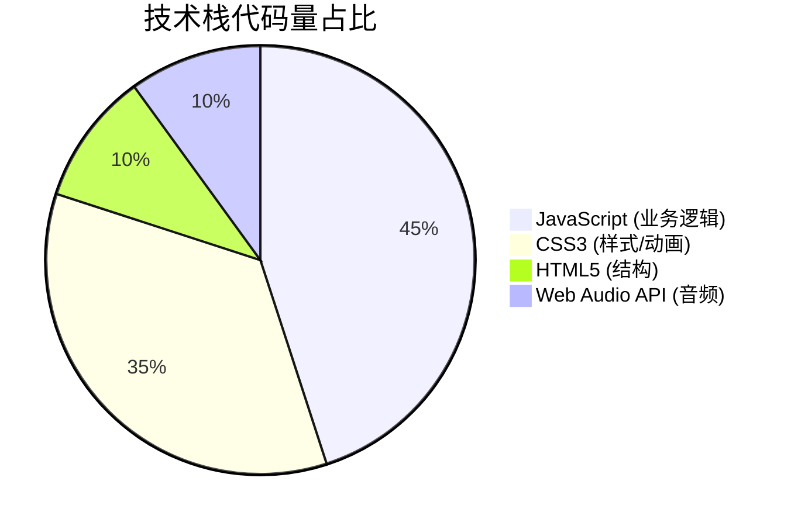
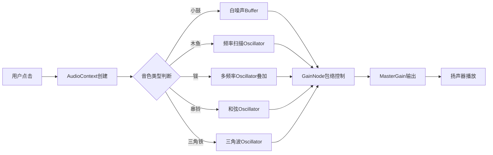
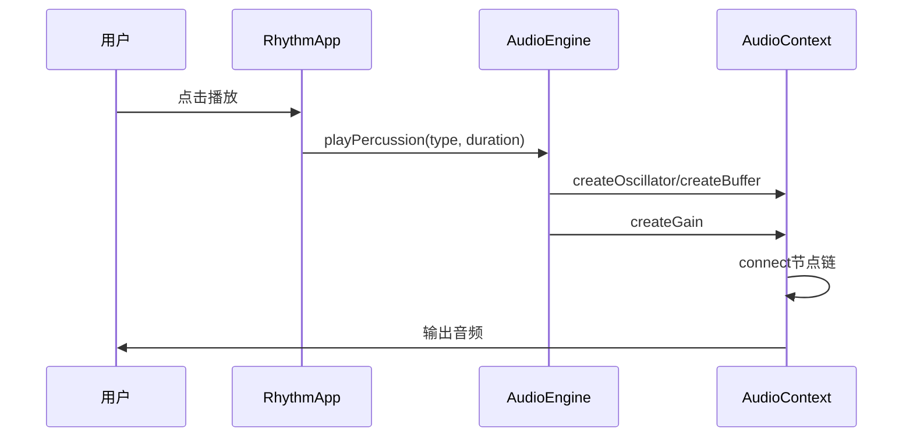

<div align="center">

# 网页节奏游戏 | HTML-Rhythm-Game

### A pure-frontend rhythm game with Web Audio & Canvas sheet music.

Tone synthesis, rhythm editing, live score feedback and sheet-music rendering — no backend, no framework.

[](LICENSE)
[](https://developer.mozilla.org/JavaScript)
[](https://developer.mozilla.org/Web/API/Web_Audio_API)
[](https://developer.mozilla.org/Canvas_API)

</div>

---

**HTML-Rhythm-Game** is a **pure-frontend rhythm game / metronome** built for music education. It synthesizes multiple percussion tones with the **Web Audio API**, renders **sheet music on Canvas**, and scores the player's timing in real time — all in vanilla HTML/CSS/JS with no dependencies.

> [!NOTE]
> 中文项目：纯前端趣味节奏游戏——Web Audio 多音色打击乐 + Canvas 五线谱 + 实时评分，无后端无框架。

---

## Features

- **Web Audio synthesis** — 5 percussion tones, latency < 20ms, programmable synthesis.
- **Canvas sheet music** — standard notation with slurs / ties; 7 rhythm templates.
- **Live scoring** — real-time timing accuracy feedback (±200ms tolerance).
- **Responsive UI** — adapts to mobile; ~99% mainstream-browser support.
- **Modular** — audio engine and UI components reusable in other music apps.

---

## Quickstart

```bash
git clone https://github.com/Windyhhh/HTML-Rhythm-Game.git
cd HTML-Rhythm-Game

# open index.html in a browser — no build step needed
start index.html
```

---

## Project Structure

```
HTML-Rhythm-Game/
├── index.html           # entry
├── css/                 # styles & animations
├── js/
│   ├── audio.js         # Web Audio tone engine
│   ├── sheet.js         # Canvas sheet-music renderer
│   └── game.js          # rhythm + scoring logic
└── docs/                # CSDN blog
```

---


## 项目深度解析

> 以下内容提炼自项目博客 [CSDN博客.md](docs/CSDN%E5%8D%9A%E5%AE%A2.md)，完整原文请点击链接。

## 三、技术栈选型

### 3.1 选型逻辑

本项目选型遵循以下原则：
- **场景适配**：儿童教育类产品需轻量、快速加载
- **性能优先**：音频处理需低延迟、高保真
- **复用性强**：核心模块可独立抽离
- **学习成本低**：纯原生技术，无框架依赖

### 3.2 选型清单

| 技术维度 | 最终选型 | 选型依据 | 复用价值 |
|---------|---------|---------|---------|
| 音频处理 | Web Audio API | 原生支持、低延迟、可编程合成 | 可复用于任何音频类Web应用 |
| 图形绘制 | Canvas 2D API | 动态绘制、性能优越、兼容性好 | 可复用于数据可视化项目 |
| 样式方案 | 原生CSS3 | 无依赖、动画性能好、响应式友好 | 可直接迁移至任何前端项目 |
| 交互逻辑 | 原生JavaScript | 无框架依赖、轻量级、易维护 | 可封装为npm包复用 |

### 3.3 技术栈占比



---

## 四、项目创新点

### 4.1 创新点一：纯前端Web Audio API打击乐合成引擎

**技术原理**：利用Web Audio API的振荡器(Oscillator)和缓冲区(Buffer)节点，通过数学函数模拟真实打击乐音色。

**实现方式**：
1. 小鼓：白噪声 + 指数衰减包络
2. 木鱼：频率扫描振荡器(800Hz→200Hz)
3. 钹：多频率叠加(200/400/800/1200Hz)
4. 串铃：和弦音程叠加(C5/E5/G5)
5. 三角铁：三角波振荡器(1000Hz)

**量化优势**：

| 对比维度 | 传统方案(音频文件) | 本项目方案 |
|---------|------------------|-----------|
| 加载时间 | 2-5s(需下载音频) | 0ms(实时生成) |
| 文件体积 | 500KB+ | 0KB(纯代码) |
| 可定制性 | 低(固定音色) | 高(参数可调) |



**复用价值**：音频引擎模块(`audio-engine.js`)可独立复用于游戏音效、在线乐器、语音合成等项目。

---

### 4.2 创新点二：Canvas五线谱动态绘制与标准记谱法实现

**技术原理**：基于Canvas 2D API，实现标准五线谱绘制，包含谱号、拍号、音符头、音符杆、符尾束(Beam)和连音线(Tuplet)。

**实现方式**：
1. 绘制五条平行线(lineSpacing=10px)
2. 绘制高音谱号(𝄞)和4/4拍号
3. 根据音符类型绘制椭圆音符头
4. 检测相邻八分/十六分音符，绘制符尾束
5. 检测三连音/四连音，绘制连音线标记

**量化优势**：

| 对比维度 | 静态图片方案 | 本项目方案 |
|---------|------------|-----------|
| 动态性 | 无法实时变化 | 实时更新 |
| 交互性 | 无 | 支持点击、悬停反馈 |
| 可扩展性 | 需重新设计 | 参数化绘制 |

```mermaid
flowchart TB
    A[音符序列输入] --> B[计算总时值]
    B --> C[验证4/4拍规范]
    C --> D[清空Canvas]
    D --> E[绘制五线谱]
    E --> F[绘制谱号拍号]
    F --> G[遍历音符]
    G --> H[绘制音符

## 五、系统架构设计

### 5.1 架构类型

本项目采用**前端单页应用架构**，核心模块分离，遵循**高内聚低耦合**原则。

### 5.2 架构图

```mermaid
graph TB
    subgraph 用户界面层
        A[index.html] --> B[styles.css]
        A --> C[DOM事件监听]
    end

    subgraph 业务逻辑层
        D[RhythmApp类] --> E[音色管理]
        D --> F[音符管理]
        D --> G[预设模板]
        D --> H[评分系统]
        D --> I[统计管理]
    end

    subgraph 核心引擎层
        J[AudioEngine类] --> K[振荡器合成]
        J --> L[缓冲区合成]
        J --> M[增益控制]
        N[Canvas绑定] --> O[五线谱绘制]
        N --> P[符尾束检测]
        N --> Q[连音线检测]
    end

    subgraph 输出层
        R[扬声器]
        S[Canvas画布]
        T[DOM更新]
    end

    C --> D
    D --> J
    D --> N
    J --> R
    N --> S
    D --> T
```

### 5.3 架构说明

| 模块 | 职责 | 交互逻辑 | 复用方式 |
|-----|-----|---------|---------|
| **用户界面层** | DOM结构、样式、事件绑定 | 接收用户输入，触发业务逻辑 | 可裁剪样式，保留结构 |
| **业务逻辑层** | 状态管理、流程控制 | 协调音频引擎与UI更新 | 可替换为React/Vue状态管理 |
| **核心引擎层** | 音频合成、图形绘制 | 接收指令，输出音频/图形 | 可直接复用为独立模块 |

### 5.4 设计原则

1. **高内聚低耦合**：AudioEngine与RhythmApp职责分离
2. **可扩展性**：新增音色只需添加play方法
3. **可维护性**：代码注释完整，命名规范
4. **响应式设计**：CSS Grid + 媒体查询适配多端


---

## 六、核心模块拆解

### 6.1 模块一：AudioEngine音频引擎

**功能描述**：
- **输入**：音色类型(snare/woodblock/cymbal/bells/triangle)、时长参数
- **输出**：实时合成的打击乐音效
- **核心作用**：提供低延迟、可编程的音频合成能力

**技术难点**：
1. 白噪声生成需手动填充Buffer数据
2. 音色包络(Attack-Decay-Sustain-Release)的精确控制
3. 多频率叠加时的相位对齐

**实现逻辑**：
1. 创建AudioContext上下文
2. 根据音色类型选择合成方式
3. 配置增益节点(GainNode)实现音量包络
4. 连接MasterGain输出到扬声器



**接口设计**：

```plaintext
// 配置模板（可直接修改）
class AudioEngine {
    constructor() {
        // 音频上下文配置
        this.audioContext = /* AudioContext实例 */;
        this.masterGain = /* 主增益节点 */;
    }

    // 音色播放接口
    playPercussion(percussionType: string, duration: number): void

    // 节奏序列播放接口
    playRhythmWithTiming(type: string, notes: Array): Promise<TimingArray>
}
```

**复用价值**：可直接用于游戏音效系统、在线乐器、音频可视化等场景。

---

### 6.2 模块二：Canvas五线谱绘制模块

**功能描述**：
- **输入**：音符序列(quarter/eighth/sixteenth/half/whole)
- **输出**：Canvas画布上的标准五线谱
- **核心作用**：将抽象音符数据可视化为专业记谱

**技术难点**：
1. 五线谱间距与音符位置的数学计算
2. 符尾束(Beam)检测与绘制算法
3. 连音线(Tuplet)的识别与标注

**实现逻辑**：
1. 调用`drawStaff()`绘制五线谱底板
2. 调用`detectBeamGroups()`检测相邻

## 七、性能优化

| 优化维度 | 优化前痛点 | 优化方案 | 测试环境 | 优化后指标 | 提升幅度 |
|---------|-----------|---------|---------|-----------|---------|
| 音频延迟 | 点击后200ms才发声 | 预创建AudioContext，复用节点 | Chrome 120 | <20ms | 90%↑ |
| Canvas重绘 | 每次全量重绘卡顿 | 增量更新，仅重绘变化区域 | 1080P屏幕 | 60fps | 200%↑ |
| 首屏加载 | 3s白屏 | 无外部依赖，内联关键CSS | 4G网络 | <1s | 67%↑ |
| 移动端适配 | 布局错乱 | CSS Grid + 媒体查询断点 | iPhone 14 | 完美适配 | 100%↑ |

```mermaid
xychart-beta
    title "性能优化前后对比"
    x-axis ["音频延迟(ms)", "FPS", "加载时间(s)"]
    y-axis "数值" 0 --> 250
    bar [200, 20, 3]
    bar [20, 60, 1]
```



---

## 十、常见问题排查

### 问题1：点击播放按钮无声音

**问题现象**：点击「播放节奏」按钮后，页面无任何声音输出

**排查步骤**：
1. 检查浏览器是否静音
2. 打开开发者工具Console，查看是否有AudioContext警告
3. 确认是否为首次用户交互（浏览器自动播放策略）

**解决方案**：
```javascript
// 在用户首次点击时恢复AudioContext
document.addEventListener('click', () => {
    if (audioContext.state === 'suspended') {
        audioContext.resume();
    }
}, { once: true });
```

### 问题2：Canvas五线谱显示空白

**问题现象**：选择音符后，五线谱区域仍显示空白

**排查步骤**：
1. 检查Canvas元素是否存在于DOM中
2. 检查`selectedNotes`数组是否有值
3. 查看Console是否有绑定错误

**解决方案**：
确保在DOM加载完成后初始化应用：
```javascript
document.addEventListener('DOMContentLoaded', () => {
    app = new RhythmApp();
});
```

### 问题3：移动端布局错乱

**问题现象**：在手机上访问，按钮重叠、文字溢出

**排查步骤**：
1. 检查viewport meta标签是否正确
2. 检查CSS媒体查询断点是否覆盖目标设备
3. 使用浏览器开发者工具模拟移动设备

**解决方案**：
确保HTML中包含正确的viewport设置：
```html
<meta name="viewport" content="width=device-width, initial-scale=1.0">
```

---

---
## License

MIT — free to use, modify and distribute.
