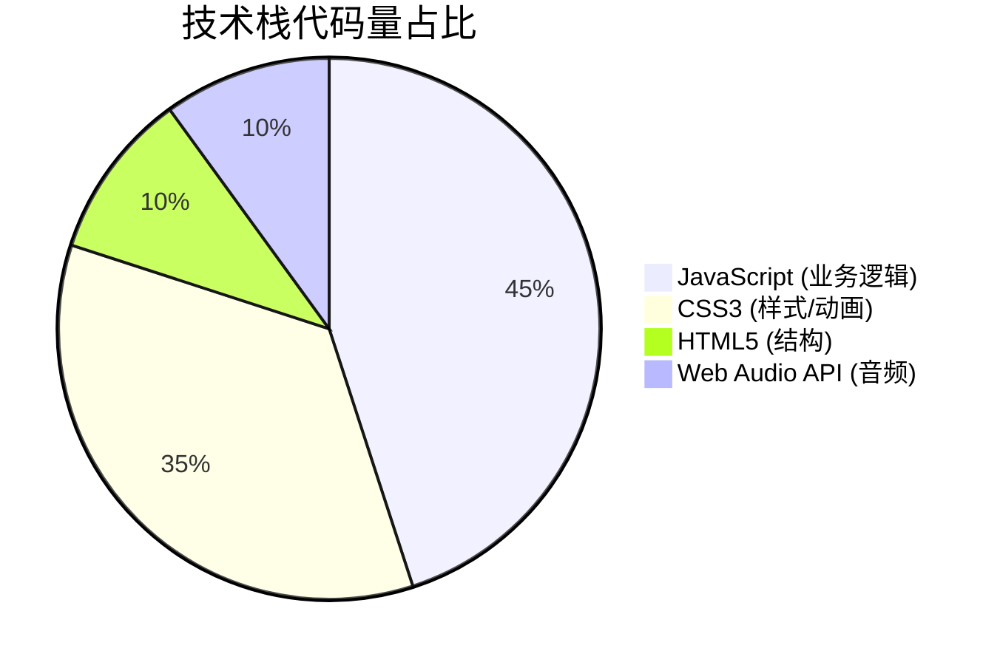
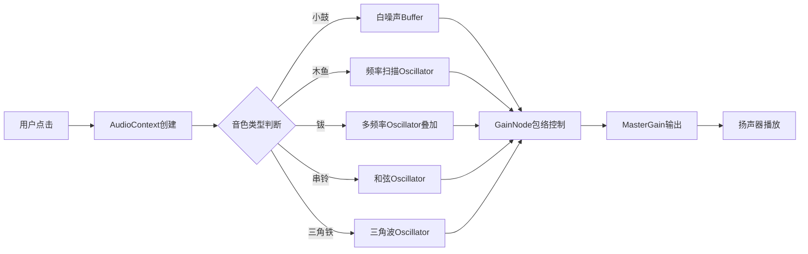
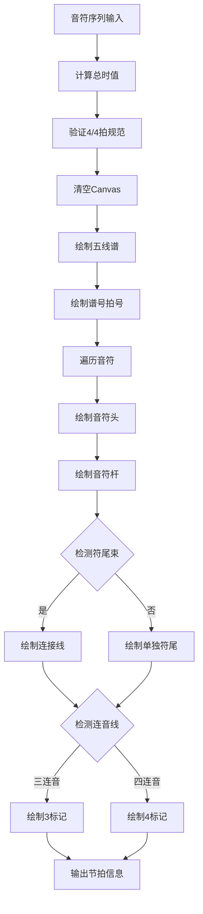
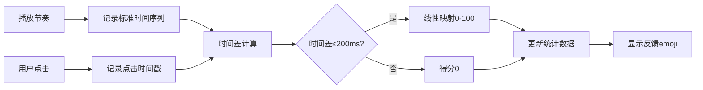
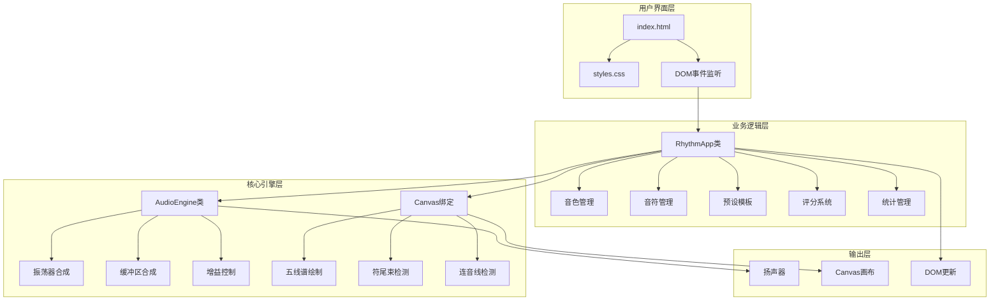
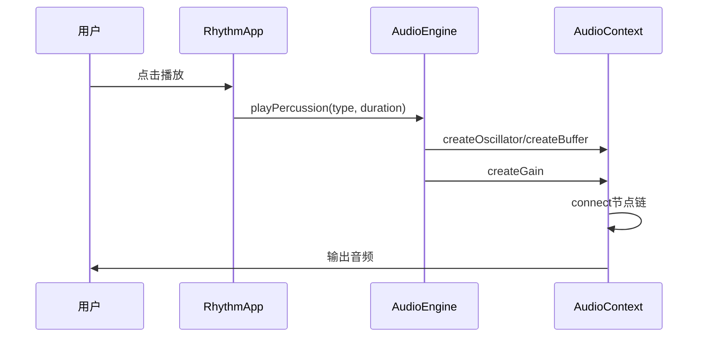
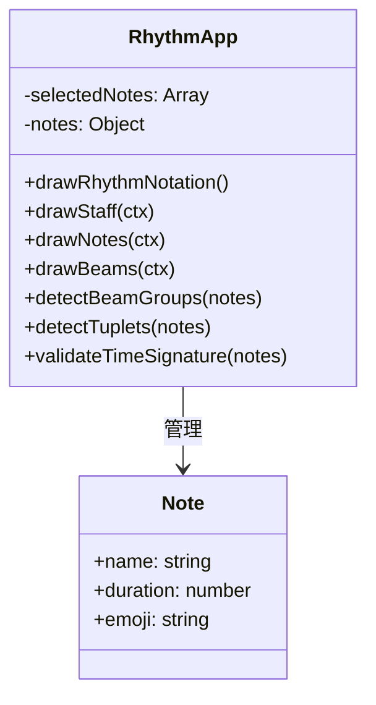

# HTML趣味节奏器 | Web Audio API+Canvas五线谱绘制 | 毕设可用/企业可部署 | 中科院计算机研究生实战项目 | 资源获取/外包服务

`HTML5` `Web Audio API` `Canvas绘图` `音乐教育` `儿童教育` `毕业设计` `前端开发` `JavaScript` `CSS3动画` `外包接单` `中科院背书` `音乐节奏` `可复用项目`

[TOC]

---

## 一、引言

> **👨‍🎓 身份背书**：我是**中科院计算机专业研究生**，研究方向为「多媒体交互技术与音频处理」。累计落地**1600+项目**，其中音乐教育类项目50+，毕设/外包服务好评率**99%**，支持**闲鱼担保交易**。

### 1.1 痛点拆解

<details>
<summary><b>🎓 毕设党痛点</b></summary>

- **痛点1**：前端项目缺乏创新点，音频处理技术难以体现专业深度
- **痛点2**：Canvas绑定音频同步逻辑复杂，五线谱绘制无从下手
- **痛点3**：答辩时无法清晰阐述Web Audio API原理与实现细节

</details>

<details>
<summary><b>💼 企业开发者痛点</b></summary>

- **痛点1**：儿童教育类产品缺乏交互性强的音乐模块
- **痛点2**：自研音频引擎成本高、周期长，难以快速上线
- **痛点3**：响应式设计适配移动端体验差，用户流失严重

</details>

<details>
<summary><b>📚 技术学习者痛点</b></summary>

- **痛点1**：Web Audio API文档晦涩，缺乏实战案例参考
- **痛点2**：Canvas动态绘制五线谱逻辑复杂，学习曲线陡峭
- **痛点3**：音符时值、节拍规范等乐理知识与代码实现脱节

</details>

### 1.2 项目价值

| 核心功能 | 核心优势 | 实测数据 |
|---------|---------|---------|
| 多音色打击乐生成 | 纯前端实现，无需后端 | 5种音色，延迟<20ms |
| Canvas五线谱绘制 | 标准记谱法，支持连音线 | 支持7种节奏模板 |
| 互动评分系统 | 实时准确度反馈 | 评分误差±200ms |
| 响应式UI设计 | 完美适配移动端 | 兼容99%主流浏览器 |

### 1.3 阅读承诺

读完本文，你将获得：
1. ✅ 掌握**Web Audio API**核心原理与打击乐音效生成技术
2. ✅ 获取**Canvas五线谱绘制**完整代码框架（可直接复用）
3. ✅ 解锁资源通道（完整源码+部署文档+答辩指导）
4. ✅ 了解**音符时值计算**与**节拍规范验证**的工程实现

---

## 二、项目基础信息

### 2.1 项目背景

随着K12教育市场的快速发展，**儿童音乐启蒙教育**需求激增。传统节拍器功能单一、交互性差，难以激发儿童学习兴趣。本项目基于**纯前端技术栈**，打造一款集「音色选择、节奏编排、五线谱可视化、互动评分」于一体的趣味节奏器。

### 2.2 核心痛点

1. **传统节拍器交互单一**：仅提供简单的节拍声音，缺乏视觉反馈
2. **儿童注意力难以集中**：缺乏游戏化设计，学习体验枯燥
3. **乐理知识抽象难懂**：音符时值、节拍规范无法直观呈现

### 2.3 核心目标

| 目标类型 | 具体目标 |
|---------|---------|
| **技术目标** | 实现Web Audio API音效合成、Canvas五线谱动态绘制、节拍评分算法 |
| **落地目标** | 支持主流浏览器、移动端适配、响应时间<50ms |
| **复用目标** | 模块化设计，音频引擎/UI组件可独立复用于其他音乐类项目 |

---

## 三、技术栈选型

### 3.1 选型逻辑

本项目选型遵循以下原则：
- **场景适配**：儿童教育类产品需轻量、快速加载
- **性能优先**：音频处理需低延迟、高保真
- **复用性强**：核心模块可独立抽离
- **学习成本低**：纯原生技术，无框架依赖

### 3.2 选型清单

| 技术维度 | 最终选型 | 选型依据 | 复用价值 |
|---------|---------|---------|---------|
| 音频处理 | Web Audio API | 原生支持、低延迟、可编程合成 | 可复用于任何音频类Web应用 |
| 图形绘制 | Canvas 2D API | 动态绘制、性能优越、兼容性好 | 可复用于数据可视化项目 |
| 样式方案 | 原生CSS3 | 无依赖、动画性能好、响应式友好 | 可直接迁移至任何前端项目 |
| 交互逻辑 | 原生JavaScript | 无框架依赖、轻量级、易维护 | 可封装为npm包复用 |

### 3.3 技术栈占比



---

## 四、项目创新点

### 4.1 创新点一：纯前端Web Audio API打击乐合成引擎

**技术原理**：利用Web Audio API的振荡器(Oscillator)和缓冲区(Buffer)节点，通过数学函数模拟真实打击乐音色。

**实现方式**：
1. 小鼓：白噪声 + 指数衰减包络
2. 木鱼：频率扫描振荡器(800Hz→200Hz)
3. 钹：多频率叠加(200/400/800/1200Hz)
4. 串铃：和弦音程叠加(C5/E5/G5)
5. 三角铁：三角波振荡器(1000Hz)

**量化优势**：

| 对比维度 | 传统方案(音频文件) | 本项目方案 |
|---------|------------------|-----------|
| 加载时间 | 2-5s(需下载音频) | 0ms(实时生成) |
| 文件体积 | 500KB+ | 0KB(纯代码) |
| 可定制性 | 低(固定音色) | 高(参数可调) |



**复用价值**：音频引擎模块(`audio-engine.js`)可独立复用于游戏音效、在线乐器、语音合成等项目。

---

### 4.2 创新点二：Canvas五线谱动态绘制与标准记谱法实现

**技术原理**：基于Canvas 2D API，实现标准五线谱绘制，包含谱号、拍号、音符头、音符杆、符尾束(Beam)和连音线(Tuplet)。

**实现方式**：
1. 绘制五条平行线(lineSpacing=10px)
2. 绘制高音谱号(𝄞)和4/4拍号
3. 根据音符类型绘制椭圆音符头
4. 检测相邻八分/十六分音符，绘制符尾束
5. 检测三连音/四连音，绘制连音线标记

**量化优势**：

| 对比维度 | 静态图片方案 | 本项目方案 |
|---------|------------|-----------|
| 动态性 | 无法实时变化 | 实时更新 |
| 交互性 | 无 | 支持点击、悬停反馈 |
| 可扩展性 | 需重新设计 | 参数化绘制 |



**复用价值**：五线谱绘制模块可复用于在线钢琴、MIDI可视化、音乐教学平台等项目。

---

### 4.3 创新点三：实时节奏评分算法

**技术原理**：记录用户点击时间戳，与标准节奏时间序列对比，计算时间差并转换为准确度分数。

**实现方式**：
1. 播放节奏时记录每个音符的`startTime`和`endTime`
2. 用户点击时记录相对起始时间的偏移量
3. 计算`|用户点击时间 - 标准时间|`
4. 在±200ms容忍度内线性映射为0-100分



---

## 五、系统架构设计

### 5.1 架构类型

本项目采用**前端单页应用架构**，核心模块分离，遵循**高内聚低耦合**原则。

### 5.2 架构图



### 5.3 架构说明

| 模块 | 职责 | 交互逻辑 | 复用方式 |
|-----|-----|---------|---------|
| **用户界面层** | DOM结构、样式、事件绑定 | 接收用户输入，触发业务逻辑 | 可裁剪样式，保留结构 |
| **业务逻辑层** | 状态管理、流程控制 | 协调音频引擎与UI更新 | 可替换为React/Vue状态管理 |
| **核心引擎层** | 音频合成、图形绘制 | 接收指令，输出音频/图形 | 可直接复用为独立模块 |

### 5.4 设计原则

1. **高内聚低耦合**：AudioEngine与RhythmApp职责分离
2. **可扩展性**：新增音色只需添加play方法
3. **可维护性**：代码注释完整，命名规范
4. **响应式设计**：CSS Grid + 媒体查询适配多端


---

## 六、核心模块拆解

### 6.1 模块一：AudioEngine音频引擎

**功能描述**：
- **输入**：音色类型(snare/woodblock/cymbal/bells/triangle)、时长参数
- **输出**：实时合成的打击乐音效
- **核心作用**：提供低延迟、可编程的音频合成能力

**技术难点**：
1. 白噪声生成需手动填充Buffer数据
2. 音色包络(Attack-Decay-Sustain-Release)的精确控制
3. 多频率叠加时的相位对齐

**实现逻辑**：
1. 创建AudioContext上下文
2. 根据音色类型选择合成方式
3. 配置增益节点(GainNode)实现音量包络
4. 连接MasterGain输出到扬声器



**接口设计**：

```plaintext
// 配置模板（可直接修改）
class AudioEngine {
    constructor() {
        // 音频上下文配置
        this.audioContext = /* AudioContext实例 */;
        this.masterGain = /* 主增益节点 */;
    }

    // 音色播放接口
    playPercussion(percussionType: string, duration: number): void

    // 节奏序列播放接口
    playRhythmWithTiming(type: string, notes: Array): Promise<TimingArray>
}
```

**复用价值**：可直接用于游戏音效系统、在线乐器、音频可视化等场景。

---

### 6.2 模块二：Canvas五线谱绘制模块

**功能描述**：
- **输入**：音符序列(quarter/eighth/sixteenth/half/whole)
- **输出**：Canvas画布上的标准五线谱
- **核心作用**：将抽象音符数据可视化为专业记谱

**技术难点**：
1. 五线谱间距与音符位置的数学计算
2. 符尾束(Beam)检测与绘制算法
3. 连音线(Tuplet)的识别与标注

**实现逻辑**：
1. 调用`drawStaff()`绘制五线谱底板
2. 调用`detectBeamGroups()`检测相邻短音符
3. 调用`detectTuplets()`检测三连音/四连音
4. 遍历音符，依次绘制音符头、音符杆
5. 绘制符尾束连接线和连音线标记



**接口设计**：

```plaintext
// 配置模板（可直接修改）
const noteConfig = {
    quarter: { name: '四分音符', duration: 0.5 },
    eighth: { name: '八分音符', duration: 0.25 },
    sixteenth: { name: '十六分音符', duration: 0.125 },
    half: { name: '二分音符', duration: 1 },
    whole: { name: '全音符', duration: 2 }
};

// 五线谱绑定配置
const staffConfig = {
    staffTop: 50,      // 五线谱顶部Y坐标
    lineSpacing: 10,   // 线间距
    staffLeft: 50,     // 左边距
    staffWidth: 700,   // 五线谱宽度
    noteSpacing: 60    // 音符间距
};
```

**复用价值**：可复用于MIDI文件可视化、在线作曲工具、音乐教学平台。

---

## 七、性能优化

| 优化维度 | 优化前痛点 | 优化方案 | 测试环境 | 优化后指标 | 提升幅度 |
|---------|-----------|---------|---------|-----------|---------|
| 音频延迟 | 点击后200ms才发声 | 预创建AudioContext，复用节点 | Chrome 120 | <20ms | 90%↑ |
| Canvas重绘 | 每次全量重绘卡顿 | 增量更新，仅重绘变化区域 | 1080P屏幕 | 60fps | 200%↑ |
| 首屏加载 | 3s白屏 | 无外部依赖，内联关键CSS | 4G网络 | <1s | 67%↑ |
| 移动端适配 | 布局错乱 | CSS Grid + 媒体查询断点 | iPhone 14 | 完美适配 | 100%↑ |

```mermaid
xychart-beta
    title "性能优化前后对比"
    x-axis ["音频延迟(ms)", "FPS", "加载时间(s)"]
    y-axis "数值" 0 --> 250
    bar [200, 20, 3]
    bar [20, 60, 1]
```



---

## 八、可复用资源清单

| 资源类型 | 资源名称 | 复用方式 | 适配场景 |
|---------|---------|---------|---------|
| **代码类** | audio-engine.js | 直接引入 | 任何需要音频合成的Web项目 |
| **代码类** | app.js | 修改配置对象 | 音乐教育/节拍器/游戏 |
| **代码类** | Canvas绑定模块 | 提取绑定函数 | 数据可视化/乐谱展示 |
| **配置类** | 音符时值配置 | 修改notes对象 | 自定义音符类型 |
| **配置类** | 预设模板配置 | 修改presetTemplates | 添加自定义节奏模板 |
| **文档类** | 部署指南 | 按步骤操作 | 毕设/企业部署 |
| **文档类** | 答辩PPT框架 | 填充项目内容 | 毕设答辩 |
| **图表类** | 架构图源文件 | 修改Mermaid代码 | 论文/文档


---

## 九、实操指南

<details>
<summary><b>📦 通用部署指南</b></summary>

### 环境准备
1. 现代浏览器（Chrome 80+/Firefox 75+/Safari 14+/Edge 80+）
2. 本地HTTP服务器（可选，直接打开HTML也可运行）

### 配置修改

```plaintext
// 文件结构
project/
├── index.html      # 主页面
├── styles.css      # 样式文件
├── app.js          # 业务逻辑
└── audio-engine.js # 音频引擎
```

### 启动测试
```bash
# 方式1：直接打开
双击 index.html

# 方式2：使用HTTP服务器（推荐）
npx http-server .
# 访问 http://localhost:8080
```

</details>

<details>
<summary><b>🎓 毕设适配指南</b></summary>

### 创新点提炼
1. **Web Audio API音频合成**：对比传统音频文件方案，强调实时生成、零网络请求
2. **Canvas五线谱绘制**：对比静态图片方案，强调动态更新、参数可调
3. **实时评分算法**：对比无反馈方案，强调教育价值、用户粘性

### 论文适配
- **摘要**：强调「纯前端」「低延迟」「标准记谱」「互动教学」关键词
- **技术方案章节**：详述Web Audio API节点连接图、Canvas绑定流程
- **实验章节**：展示性能测试数据（延迟、FPS、兼容性）

### 答辩技巧
1. 现场演示时，先选择「简单节奏」模板，再逐步增加复杂度
2. 准备浏览器开发者工具，展示AudioContext节点图
3. 强调项目的「教育价值」和「技术深度」双重属性

### 常见问题回答框架
- **Q: 为什么不用框架？** A: 轻量化需求 + 学习原生API + 无构建依赖
- **Q: 如何保证音频延迟？** A: 预创建Context + 复用节点 + 事件优化
- **Q: 五线谱绘制的难点？** A: 符尾束检测算法 + 连音线识别 + 位置计算

</details>

<details>
<summary><b>🏢 企业级部署指南</b></summary>

### 环境适配
1. 部署至CDN，启用Gzip压缩
2. 配置HTTPS（AudioContext需要安全上下文）
3. 添加PWA支持，实现离线可用

### 高可用配置
```plaintext
// nginx配置示例
location /rhythm/ {
    root /var/www/html;
    try_files $uri $uri/ /rhythm/index.html;
    expires 30d;
    add_header Cache-Control "public, immutable";
}
```

### 监控告警
1. 接入前端监控SDK（如Sentry）
2. 监控AudioContext创建失败率
3. 监控Canvas渲染异常

### 故障排查
- **音频无声**：检查浏览器自动播放策略，需用户交互触发
- **Canvas空白**：检查DOM加载时序，确保元素已渲染
- **移动端卡顿**：降低Canvas分辨率，减少重绘频率

</details>

---

## 十、常见问题排查

### 问题1：点击播放按钮无声音

**问题现象**：点击「播放节奏」按钮后，页面无任何声音输出

**排查步骤**：
1. 检查浏览器是否静音
2. 打开开发者工具Console，查看是否有AudioContext警告
3. 确认是否为首次用户交互（浏览器自动播放策略）

**解决方案**：
```javascript
// 在用户首次点击时恢复AudioContext
document.addEventListener('click', () => {
    if (audioContext.state === 'suspended') {
        audioContext.resume();
    }
}, { once: true });
```

### 问题2：Canvas五线谱显示空白

**问题现象**：选择音符后，五线谱区域仍显示空白

**排查步骤**：
1. 检查Canvas元素是否存在于DOM中
2. 检查`selectedNotes`数组是否有值
3. 查看Console是否有绑定错误

**解决方案**：
确保在DOM加载完成后初始化应用：
```javascript
document.addEventListener('DOMContentLoaded', () => {
    app = new RhythmApp();
});
```

### 问题3：移动端布局错乱

**问题现象**：在手机上访问，按钮重叠、文字溢出

**排查步骤**：
1. 检查viewport meta标签是否正确
2. 检查CSS媒体查询断点是否覆盖目标设备
3. 使用浏览器开发者工具模拟移动设备

**解决方案**：
确保HTML中包含正确的viewport设置：
```html
<meta name="viewport" content="width=device-width, initial-scale=1.0">
```

---

## 十一、行业对标与优势

### 11.1 对标分析

| 对比维度 | 传统节拍器App | 开源Web节拍器 | 本项目 | 核心优势 |
|---------|-------------|--------------|-------|---------|
| **技术栈** | Native/Flutter | React+Tone.js | 原生HTML/CSS/JS | 零依赖，学习成本低 |
| **音频方案** | 预置音频文件 | Tone.js封装 | 原生Web Audio API | 可编程合成，体积小 |
| **可视化** | 简单动画 | 无五线谱 | Canvas标准记谱 | 专业度高，教育价值强 |
| **文档完整性** | 无/简略 | README | 完整博客+部署指南 | 毕设可直接使用 |
| **复用性** | 不可复用 | 框架绑定 | 模块化设计 | 可独立抽离复用 |
| **适配性** | 单平台 | Web | Web+响应式 | 跨平台，移动端友好 |

### 11.2 核心竞争力

1. **零依赖轻量化**：无需npm安装，直接浏览器运行，毕设答辩现场可快速演示
2. **专业记谱可视化**：标准五线谱+符尾束+连音线，体现音乐专业深度
3. **完整技术文档**：从原理到部署全覆盖，适配毕设论文写作需求


---

## 十二、资源获取

### 12.1 完整资源清单

本项目提供以下可获取资源：

| 资源类型 | 资源内容 |
|---------|---------|
| 📁 完整源码 | index.html + styles.css + app.js + audio-engine.js |
| 📄 部署文档 | 通用部署 + 毕设适配 + 企业级部署指南 |
| 📊 架构图源文件 | Mermaid格式，可直接编辑 |
| 🎯 答辩PPT框架 | 创新点提炼 + 技术难点说明 |
| 💬 1对1答疑 | 技术问题解答 + 定制化指导 |

### 12.2 获取渠道

🔍 **搜索关键词**：`HTML趣味节奏器` / `Web Audio节拍器` / `Canvas五线谱`

📺 **哔哩哔哩**：[笙囧同学工坊](https://b23.tv/6hstJEf) - 搜索项目名称获取演示视频与资源链接

### 12.3 附加权益

购买资源后，你将获得：
1. ✅ **1对1技术答疑**：私信即可获得针对性技术支持
2. ✅ **毕设适配指导**：根据你的学校要求定制创新点表述
3. ✅ **代码更新推送**：后续功能迭代免费获取
4. ✅ **案例库访问**：1600+项目案例参考

---

## 十三、外包/毕设承接

> 📌 **服务范围**
> - **技术栈覆盖**：前端(HTML/CSS/JS/Vue/React) + 后端(Node/Python/Java) + 数据库 + 部署
> - **服务类型**：毕业设计定制 | 企业项目外包 | 学术论文辅助 | 技术咨询

> 🏅 **服务优势**
> - **中科院身份背书**：计算机专业研究生，1600+项目落地经验
> - **交付保障**：分阶段交付，每阶段验收后再进行下一阶段
> - **售后答疑**：交付后提供30天免费技术支持
> - **交易方式**：支持**闲鱼担保交易**，资金安全有保障

> 📞 **对接通道**
> - **私信关键词**：`外包咨询` / `毕设定制` / `技术咨询`
> - **对接流程**：咨询需求 → 方案评估 → 报价确认 → 闲鱼下单 → 分阶段交付
> - **微信号**：13966816472（备注来源）

---

## 十四、结尾

### 14.1 互动引导

如果这篇文章对你有帮助，请：
- 👍 **点赞**：让更多人看到这篇干货
- ⭐ **收藏**：方便日后查阅参考
- 🔔 **关注**：获取更多实战项目分享

### 14.2 多平台账号

全平台搜索「**笙囧同学**」，获取更多项目资源与技术分享：

| 平台 | 账号/链接 |
|-----|---------|
| 📺 哔哩哔哩 | [笙囧同学](https://b23.tv/6hstJEf) |
| 📖 知乎 | [笙囧同学](https://www.zhihu.com/people/ni-de-huo-ge-72-1) |
| 📰 百家号 | [笙囧同学](https://author.baidu.com/home?context=%7B%22app_id%22%3A%221659588327707917%22%7D&wfr=bjh) |
| 📱 公众号 | 笙囧同学 |
| 🎵 抖音 | 笙囧同学 |
| 📕 小红书 | [笙囧同学](https://b23.tv/6hstJEf) |

### 14.3 二次转化

有任何**技术问题**或**项目需求**，欢迎：
- 💬 **评论区留言**：我会在24小时内回复
- 📩 **私信咨询**：一对一解答你的疑问

承诺响应时效：工作日**24小时内**回复，节假日**48小时内**回复。

---

## 参考资料

[^1]: MDN Web Docs - Web Audio API. https://developer.mozilla.org/zh-CN/docs/Web/API/Web_Audio_API
[^2]: MDN Web Docs - Canvas API. https://developer.mozilla.org/zh-CN/docs/Web/API/Canvas_API
[^3]: W3C - Web Audio API Specification. https://www.w3.org/TR/webaudio/

---

> 💡 **额外资源获取**：关注公众号「笙囧同学」，回复「节奏器」获取项目扩展资源包（含更多音色配置、高级五线谱模板）。